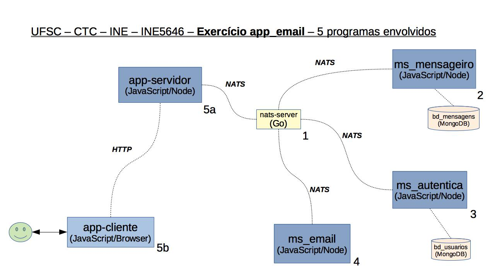

# UFSC - CTC - INE - INE5646 Programação para Web :: App email

## Aplicação para web

A aplicação tem por objetivo permitir que usuários cadastrados enviem mensagens para outros usuários cadastrados. Além disso o usuário cadastrado pode ver as mensagens que já enviou. O transporte dessas mensagens é feito por meio de e-mail.

Um usuário se cadastra fornecendo seu e-mail, seu  nome e uma senha para acesso à aplicação. A aplicação então envia um e-mail para o endereço fornecido contendo um link que, quando clicado, confirmará o cadastro.

O código da aplicação está organizado na forma de ***microserviços***. Há três microservicos:

* **ms_email**: responsável pelo envio e validação de e-mails.

* **ms_autentica**: responsável pelo cadastro e autenticação de usuários.

* **ms_mensageiro**: responsável pelo envio e leitura de mensagens.

A aplicação web, que contém a interface com o usuário, interage com os microserviços para poder atender as demandas feitas pelos usuários.

## Objetivo

O objetivo da aplicação é demonstrar uma forma de implementação da arquitetura de microserviços. A imagem a seguir  mostra a arquitetura específica desta aplicação.

 

## Tecnologias Utilizadas

Os microserviços são implementados com o *framework* **[Moleculer](https://moleculer.services/)**. A aplicação web utiliza, no lado servidor, o *framework* **[Express](https://expressjs.com/)** e, no lado cliente, a biblioteca **[React](https://pt-br.reactjs.org/)**.

A comunicação entre a aplicação principal e os microserviços e entre os próprios microserviços utiliza o software **[NATS](https://nats.io/)**. Portanto, é necessário ter acesso ou instalar  um servidor NATS configurado apropriadamente.

O microserviço **ms_email** utiliza a biblioteca **[Nodemailer](https://nodemailer.com/about/)** para enviar e-mails utilizando uma conta de e-mail cadastrada no Google. Não utilize sua conta pessoal, crie uma conta específica para este exercício. Utiliza também o serviço **[IPQUALITYSCORE](https://www.ipqualityscore.com/documentation/email-validation/overview)** para validar o e-mail, ou seja, garantir que o endereço de e-mail realmente existe.

O microserviço **ms_autentica** utiliza um banco de dados **MongoDB** para armazenar os dados dos usuários cadastrados. Recomendo a criação da base de dados via **[MLab](https://mlab.com/)**. Cada usuário é identificado por um **token JWT** gerado pela biblioteca **[jsonwebtoken](https://github.com/auth0/node-jsonwebtoken#readme)**.

O microserviço **ms_mensageiro** utiliza um banco de dados **MongoDB** para armazenar as mensagens enviadas pelos usuários. Como no *ms_autentica* recomendo a criação da base de dados via **MLab**.

## Organização do código fonte

O código fonte deste exercício está organizado da seguinte forma:

* **diretório app** : contém a aplicação para web.

* **diretório ms_email** : contém o microserviço *ms_email*.

* **diretório ms_autentica** : contém o microserviço *ms_autentica*.

* **diretório ms_mensageiro** : contém o microserviço *ms_mensageiro*.

* **diretório nats** :  contém o comando que deve ser usado para colocar no ar o servidor NATS. O servidor só aceitará conexões criptografadas (via TLS) e que contenham um **token de autenticação**.

* **diretório códigos** : contém os arquivos *.env*  utilizados pelos microserviços e pela aplicação para web.

* **diretório scripts** : uma série de scripts Linux que permitem:
  * **install.sh** : executa o comando *npm install* dos microserviços e da aplicação para web.
  * **build.sh** : executa o comando *npm run build* para gerar "os executáveis" dos microserviços e da aplicação para web.
  * **codigos.sh** : copia os arquivos *.env* utilizados pelos microserviços e pela aplicação para web para os seus locais apropriados.
  * **run.sh** : executa o comando *node build/app.js** para colocar no ar os microserviços e e aplicação para web.

Os scripts Linux mencionados acima são apenas uma comodidade para automatizar tarefas que precisam serem feitas. Seu uso, portanto, é opcional.

## Desenvolvimento da aplicação

Tanto a aplicação para web quanto os microserviços estão organizados da mesma forma.

### npm install

Comando para instalar as bibliotecas JavaScript utilizadas.

### npm start

Coloca no ar em *modo desenvolvimento* o microserviço. Para a aplicação para web há um comando para o lado cliente e um para o lado servidor.

### npm run build

Gera uma versão em *modo produção* do micro serviço. Para a aplicação para web há um comando para o lado cliente e um para o lado servidor.

### node build/app.js

Executa a versão em produção do microserviço e a aplicação para web.
